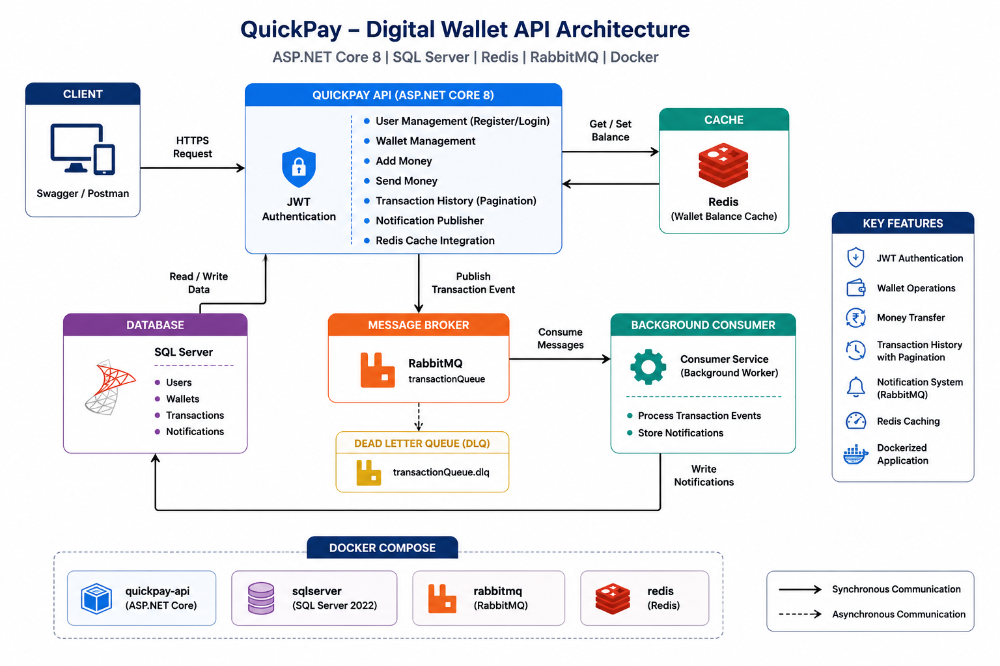
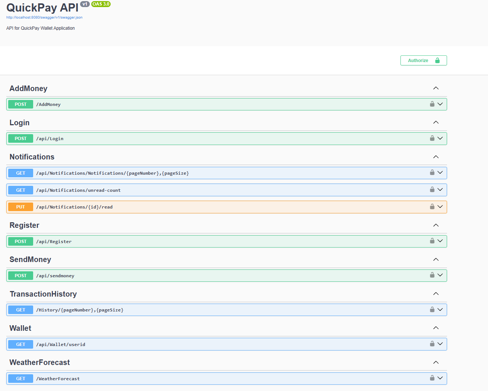
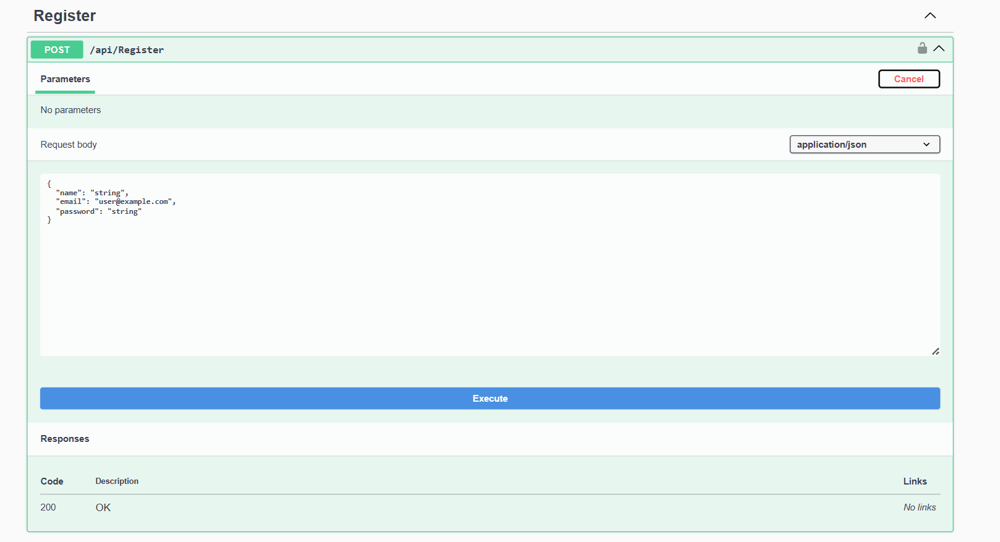
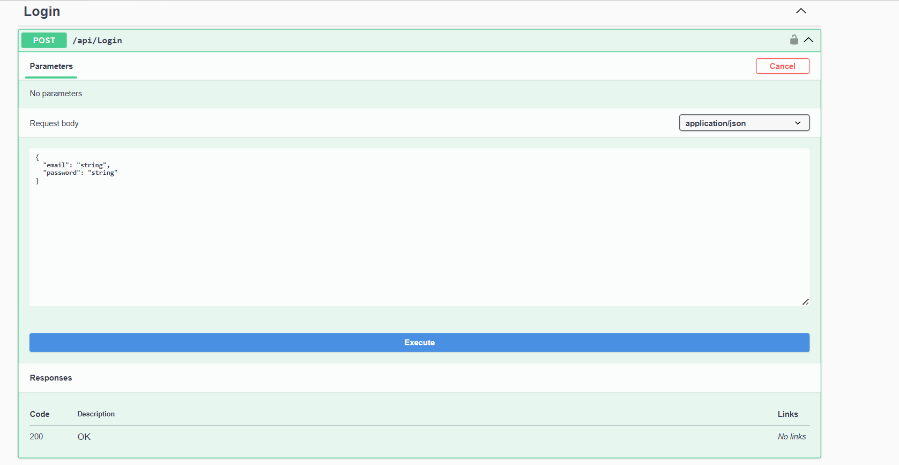
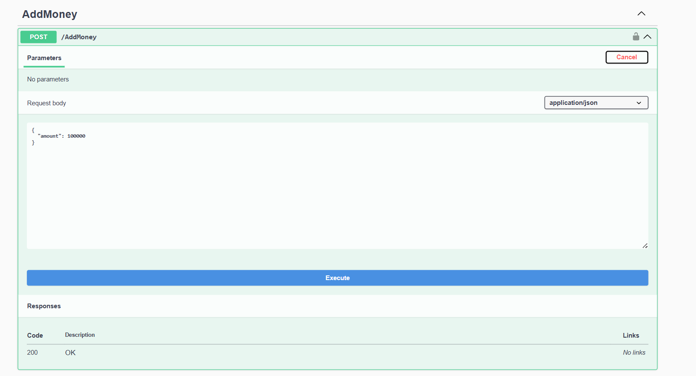
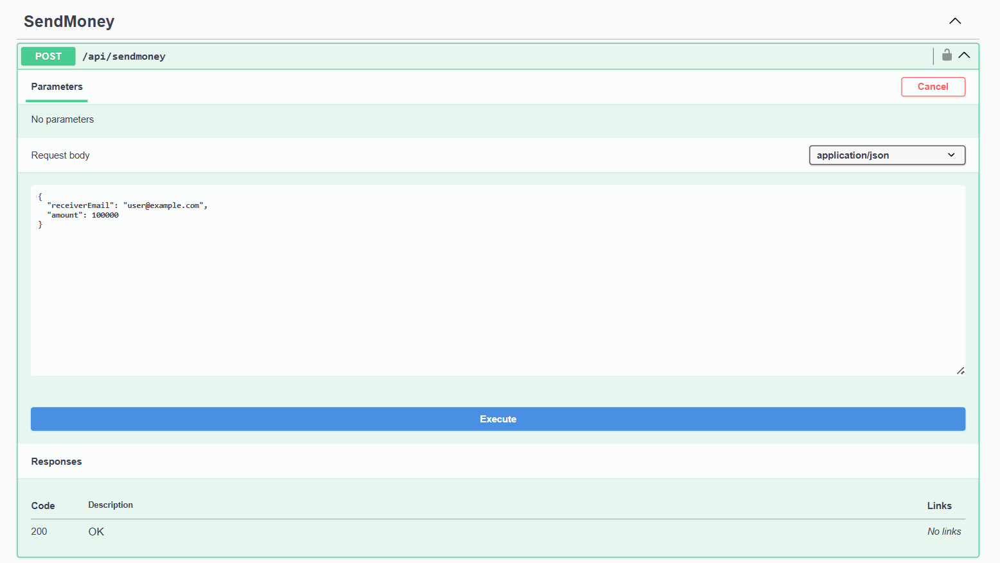

# 💳 QuickPay Wallet API

> A production-ready digital wallet backend built with **ASP.NET Core 8**, featuring JWT Authentication, SQL Server, Redis Caching, RabbitMQ Messaging, and Docker Compose.


---

## 📖 Overview

QuickPay is a secure digital wallet backend that allows users to:

- Register and authenticate using JWT
- Add money to wallet
- Send money to other users
- View wallet balance
- View paginated transaction history
- Receive asynchronous notifications
- Improve performance using Redis cache
- Run the complete application using Docker Compose

---

# 🏗️ Architecture




---

# 🚀 Features

- ✅ JWT Authentication & Authorization
- ✅ Secure Password Hashing
- ✅ Wallet Management
- ✅ Money Transfer
- ✅ Add Money
- ✅ Transaction History with Pagination
- ✅ Redis Distributed Cache
- ✅ RabbitMQ Message Queue
- ✅ Background Consumer Service
- ✅ Notification System
- ✅ SQL Server Database
- ✅ Entity Framework Core
- ✅ Dockerized Application
- ✅ Docker Compose
- ✅ RESTful APIs
- ✅ Swagger Documentation

---

# 🛠 Tech Stack

| Technology | Purpose |
|------------|---------|
| ASP.NET Core 8 | REST API |
| Entity Framework Core | ORM |
| SQL Server | Database |
| Redis | Distributed Cache |
| RabbitMQ | Message Broker |
| JWT | Authentication |
| Docker | Containerization |
| Docker Compose | Multi-container orchestration |

---

# 📂 Project Structure

```
QuickPay
│
├── Controllers/
├── Services/
├── Models/
│   ├── Domain/
│   └── DTO/
├── Data/
├── Repository/
├── Migrations/
├── Dockerfile
├── docker-compose.yml
└── Program.cs
```

---

# 🔄 System Flow

```
Client
   │
   ▼
ASP.NET Core API
   │
   ├────────► SQL Server
   │
   ├────────► Redis Cache
   │
   └────────► RabbitMQ
                     │
                     ▼
           Background Consumer
                     │
                     ▼
             Notifications Table
```

---

# 🐳 Running with Docker

Clone the repository

```bash
git clone https://github.com/hackeryash753/QuickPay-Wallet-API.git
```

Navigate to project

```bash
cd QuickPay-Wallet-API
```

Build containers

```bash
docker compose build
```

Run containers

```bash
docker compose up -d
```

Stop containers

```bash
docker compose down
```

---

# 🔑 API Endpoints

## Authentication

| Method | Endpoint |
|---------|----------|
| POST | /api/auth/register |
| POST | /api/auth/login |

---

## Wallet

| Method | Endpoint |
|---------|----------|
| POST | /api/wallet/add-money |
| POST | /api/wallet/send-money |
| GET | /api/wallet/balance |
| GET | /api/wallet/transactions |

---

# 📸 API Screenshots

## Swagger UI



---

## Register API



---

## Login API



---

## Add Money API



---

## Send Money API



---

# ⚡ Highlights

- Redis caching for wallet balance
- RabbitMQ asynchronous notifications
- Retry mechanism for RabbitMQ consumer
- Dead Letter Queue support
- JWT secured endpoints
- Dockerized development environment
- SQL Server persistence

---

# 📈 Future Improvements

- Refresh Tokens
- Email Notifications
- Rate Limiting
- API Versioning
- Serilog Logging
- Health Checks
- CI/CD Pipeline
- Azure Deployment
- Unit Testing
- Integration Testing

---

# 👨‍💻 Author

**Yash Jain**

Backend Developer

- ASP.NET Core
- C#
- SQL Server
- Docker
- RabbitMQ
- Redis

---

⭐ If you found this project useful, consider giving it a star!
